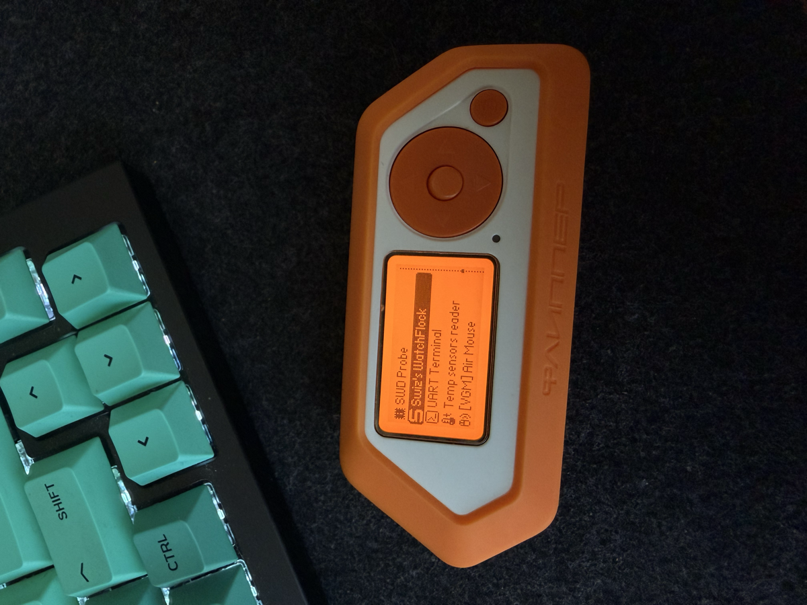
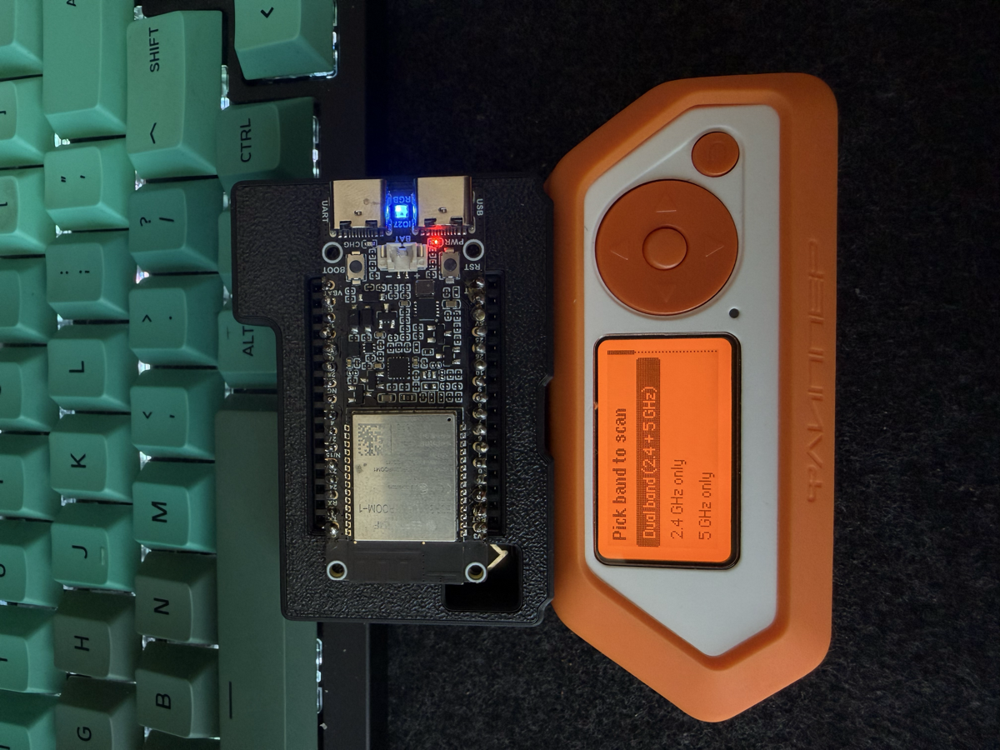
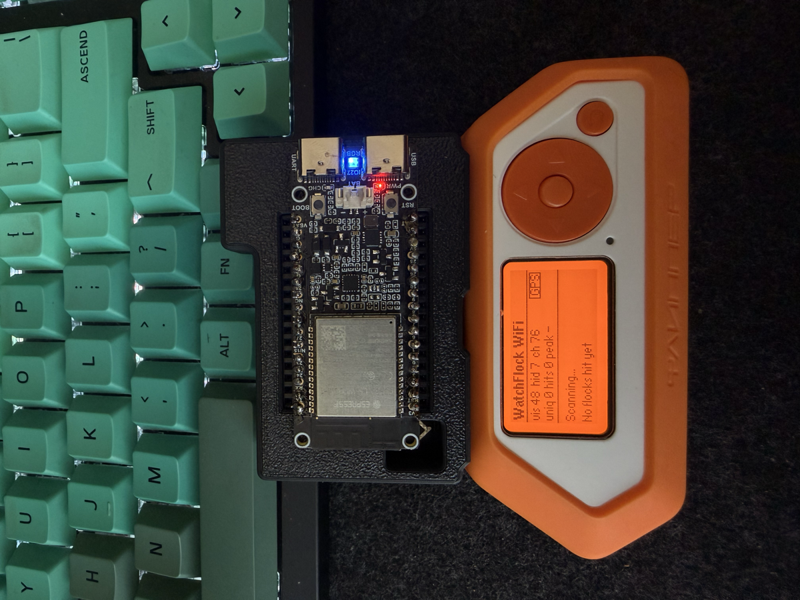

# WatchFlock

ESP32-C5 firmware for spotting **Flock Safety** ALPR cameras and **SoundThinking** (formerly ShotSpotter) acoustic gunshot sensors in the wild. Privacy-research tooling, passive detection only, no jamming, no offensive payloads.

**Why this exists.** Flock Safety quietly switched their Falcon V2 cameras to hidden SSIDs and probe-requests, which killed the old "scan for a broadcast SSID" detection approach. This fork is the response. Original research that surfaced the change can be found on [my IG reel](https://www.instagram.com/reel/DXa3n3_jXtP/).

The majority of the work is based off of a fork of [justcallmekoko/ESP32Marauder](https://github.com/justcallmekoko/ESP32Marauder). All credit for the underlying firmware goes to kokollc. This fork adds three things: a WiFi-side ALPR detector, a BLE-side Penguin-battery detector, and a tagged-text protocol that streams hits to a Flipper Zero companion app over UART.

## Quick start

What you need:

- **ESP32-C5-DevKitC-1** (N8R8, 8MB flash, 8MB PSRAM)
- **kokollc Marauder C5 Adapter** for Flipper Zero ([link](https://justcallmekokollc.com/products/marauder-c5-adapter-flipper-zero))
- **Flipper Zero**, stock firmware
- A Mac/Linux box with `arduino-cli` + [`ufbt`](https://github.com/flipperdevices/flipperzero-ufbt) installed

### 1. Build the C5 firmware

```bash
arduino-cli core install esp32:esp32@3.3.0
arduino-cli compile \
  -b "esp32:esp32:esp32c5:FlashSize=8M,PartitionScheme=default_8MB,PSRAM=enabled,CDCOnBoot=default" \
  --build-property "compiler.cpp.extra_flags=-DMARAUDER_C5 -DSWIZ_FLIPPER_PROTOCOL" \
  --build-property "compiler.c.extra_flags=-DMARAUDER_C5 -DSWIZ_FLIPPER_PROTOCOL" \
  --libraries ./libraries \
  --output-dir ./build \
  esp32_marauder
```

Pin the core to **3.3.0**. 3.3.8 has a PSRAM init regression that crashes the N8R8 bootloader. Don't change `CDCOnBoot=default` to `cdc`, it masks real error messages at boot. Long version: [BUILD-C5.md](./BUILD-C5.md).

### 2. Flash the C5

Plug the C5 alone (not yet on the koko adapter) into your computer via its USB-C. Find its port with `ls /dev/cu.usbmodem*`.

```bash
python3 -m esptool --chip esp32c5 --port /dev/cu.usbmodemXXXX --baud 460800 write_flash \
  0x2000  build/esp32_marauder.ino.bootloader.bin \
  0x8000  build/esp32_marauder.ino.partitions.bin \
  0x10000 build/esp32_marauder.ino.bin
```

Offsets are **0x2000 / 0x8000 / 0x10000**, *not* the classic ESP32 0x1000. Wrong offsets boot-loop the chip with `invalid header`. Easier alternative if you don't want to memorize that:

```bash
python3 C5_Py_Flasher/c5_flasher.py build/esp32_marauder.ino.bin
```

### 3. Sideload the Flipper FAP

Connect the Flipper to your computer. **Close qFlipper if it's open, it holds the port.**

```bash
cd flipper
ufbt launch
```

That builds the FAP, pushes it to `/ext/apps/GPIO/swiz_flock_hunter.fap` on the Flipper's SD, and launches it.

### 4. Run it

Stack the C5 on top of the koko adapter, plug the adapter into the Flipper's expansion header. Power via USB-C to the C5 (or run the Flipper on battery, the adapter pulls power down through the Flipper).

On the Flipper: **Apps → GPIO → Swiz's WatchFlock**.

<p align="center">
  
</p>

Pick a band (`Dual (2.4+5GHz)`, `2.4 GHz only`, `5.0 GHz only`, or BLE):

<p align="center">
  
</p>

Walk near suspected hardware. Hits show up live with vendor, RSSI, channel, and GPS coords if you have a fix:

<p align="center">
  
</p>

**Notifications.** The Flipper buzzes + beeps on:

- The **first sighting of each unique device** (per-MAC, so you don't get spammed, second packet from the same MAC stays quiet)
- **GPS fix acquired**, the moment `gps=ok` flips true, so you know coords will now be tagged onto subsequent hits

## where are my pcaps and gps data?

Both kinds of capture are written to the Flipper SD card under `/ext/apps_data/swiz_flock_hunter/`:

| File | What it is |
|---|---|
| `WatchFlock-hits.csv` | One row per unique device hit. Columns: timestamp, MAC, OUI, vendor, rule, SSID, RSSI, channel, confidence, GPS-fix flag, lat, lon, alt, GPS time, Flipper time. |
| `flockwifi-YYYYMMDD-HHMMSS.pcap` | Raw 802.11 frames from each scan session, framed with a radiotap header carrying channel + RSSI. Open in Wireshark. |

**Why these matter.** The CSV is your *findings record*, pop it into a spreadsheet or onto a map and you've got a list of where each Flock camera lives, when you saw it, and how strong the signal was. The PCAPs are *RF evidence*, the actual probe-req/beacon frames the cameras emit. Useful for confirming OUI matches, sharing findings with other researchers, or reproducing detections offline.

**Getting the files off the Flipper:**

- **qFlipper (easiest):** open qFlipper → File Manager tab → navigate to `SD Card → apps_data → swiz_flock_hunter` → right-click any file → Save As.
- **Flipper CLI (no GUI needed):** connect to `/dev/cu.usbmodemflip_*` at 115200 8N1 (e.g. `screen /dev/cu.usbmodemflip_XXXX 115200`), then:
  ```
  storage list /ext/apps_data/swiz_flock_hunter
  storage read /ext/apps_data/swiz_flock_hunter/WatchFlock-hits.csv
  ```
  `storage read` prints small text files directly to the terminal. For binary PCAPs, stick to qFlipper.

## what's new

Two scan modes on top of upstream Marauder:

| Mode | CLI command | Detects |
|------|-------------|---------|
| `WIFI_SCAN_FLOCK_AP` | `sniffflockwifi [-b 2g\|5g\|all]` | Pole-mounted Falcon V2s probing for hidden uplink SSIDs |
| `BT_SCAN_FLOCK_BLE` | `sniffflockble` | External Penguin batteries advertising via BLE (XUNTONG mfg ID `0x09C8`) |

Plus a build flag, `-DSWIZ_FLIPPER_PROTOCOL`, that turns on tagged-text records over UART (`HIT`, `STAT`, `HIDE`, `SWIZ ready`). That's what the [Flipper FAP](./flipper/) parses to render the live dashboard.

## Detection rules

**WiFi side** (probe-req, probe-resp, beacon parsing in promiscuous mode):

- 21 direct Flock OUIs incl. `b4:1e:52` (Flock Safety) and `e4:aa:ea` (Liteon, field-confirmed in St. Pete FL)
- Contract-manufacturer OUIs: Liteon, USI
- ShotSpotter / SoundThinking OUI `d4:11:d6`
- SSID patterns: `Flock-XXXXXX`, `test_flck` (CVE-2025-59409), `*flock*` substring (case-insensitive)

**BLE side** (BLE adverts via NimBLE):

- Penguin battery: XUNTONG manufacturer ID `0x09C8` + 10-digit name pattern (or legacy `Penguin-XXXXXXXXXX` / `FS Ext Battery`)
- Serial extraction: pulls TN-prefix + digits out of the manufacturer data block

Hits are streamed to UART (115200 baud) and dumped to SD as `flockwifi-XXXX.pcap` and `flock-XXXX.pcap` per session, with GPS-tagged CSV when a fix is available.

## Why

Stock Marauder's "Flock Sniff" only looks for BLE chatter from the optional Penguin battery. Most pole-mounted Falcon V2s run on internal battery + solar and never advertise BLE, but they do continuously probe WiFi for a hidden uplink SSID with predictable OUIs. This fork catches both surfaces.

WatchFlock is for understanding where surveillance hardware is installed in your community, *defensive* recon for journalists, researchers, civil-liberties groups, and curious civilians. It is not a jamming tool.

### Firmware ([esp32_marauder/](./esp32_marauder/))

The C5 sniffer with WIFI_SCAN_FLOCK_AP and BT_SCAN_FLOCK_BLE modes. Build and flash via [BUILD-C5.md](./BUILD-C5.md). Pin Arduino ESP32 core to 3.3.0 (3.3.8 has a PSRAM regression on the N8R8 chip), use `CDCOnBoot=default`, partition `default_8MB`.

### Flipper companion ([flipper/](./flipper/))

Live dashboard for the SWIZ tagged-text records the firmware emits over UART. Per-MAC unique counter, peak RSSI, haptic + audio alerts on first detection per device, BACK to the band picker. Build with `ufbt` from inside the `flipper/` dir. See [flipper/README.md](./flipper/README.md).

### Emitter ([emitter/](./emitter/))

WROVER-E sketch that spoofs four Flock-OUI WiFi identities and three Penguin BLE identities on rotation. Lets you test the firmware + FAP end to end without driving to a real ALPR pole. Plus debug scripts (`c5-tail.sh`, `c5-cmd.sh`) for monitoring the C5 over USB-CDC without auto-resetting it. See [emitter/README.md](./emitter/README.md).

Inspired by the [Watch_Dogs](https://en.wikipedia.org/wiki/Watch_Dogs) games. Turning the city's sensors back on the people who installed them.

By [Jake / Swiz Security](https://github.com/0xXyc).
